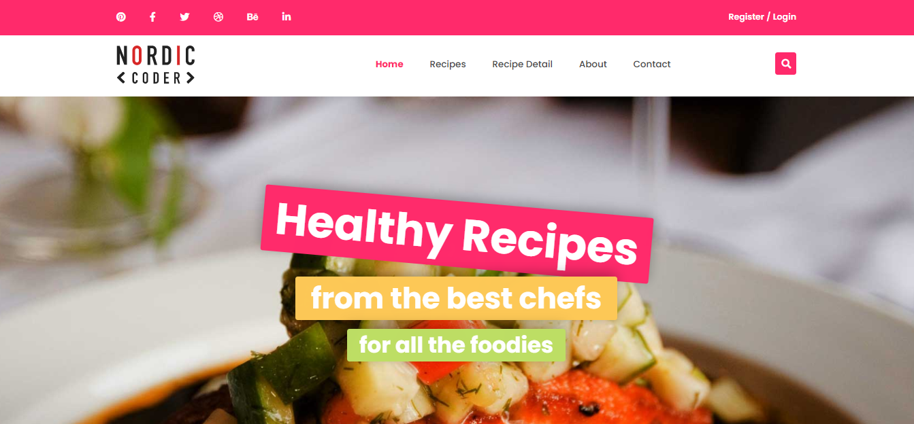

# FOOD BLOG PROJECT

## Description
Food Blog is my final project in HTML & CSS section (inside Front-end Development course) with instruction of [Mr. Hau Nguyen](https://github.com/paulnguyen-mn) at [Nordic Coder School](https://nordiccoder.com/).

*Food Blog*

## Build with 

- `HTML5`
- `CSS3`
- Responsive by `@media` Media Queries for mobile, tablet, laptop (not using Bootstrap UI library)
- A little `JavaScript`

## A few other cool features

- Use [AOS animate library](https://github.com/michalsnik/aos) to create a transition effect for website
- Use JS to smoother / slower the scrolling process for scroll-to-top button
- Use JS to handle click toggle menu on mobile

## What I learned from Mr. Hau Nguyen after HTML & CSS Course

- How to analyze layout to create HTML Tree, instead of start coding immediately ---> [Example](markdown/home-html-tree.md)
- How to organize source code directory
- How to arrange the order of CSS properties in groups for easy control and editing later ---> [Read more](https://css-tricks.com/poll-results-how-do-you-order-your-css-properties/)
- The principle is always separate layout and content when coding the UI
- How to combine flexibility between Bootstrap Grid and Flexbox to have a beautiful UI and good code
- How to use Git (Version Control System) and Github to push source code from local repository to remote repository and auto deploy with [Vercel](https://vercel.com/)
- How to use CSS Properties `transition`, `transform`, `animation` to create a effect for website
- How to use CSS Variables 
- How to use SCSS and auto compile to CSS 

And many things ...

**[Go to Food Blog](https://food-blog.vercel.app)**